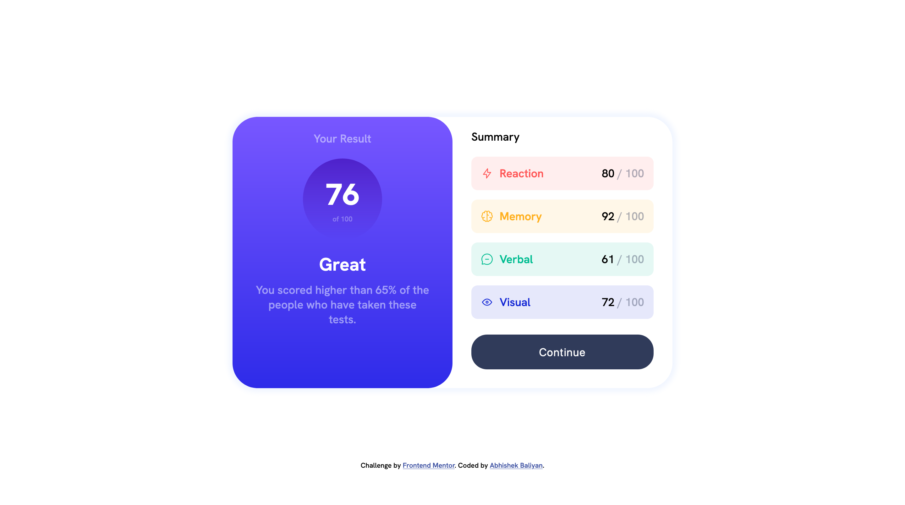
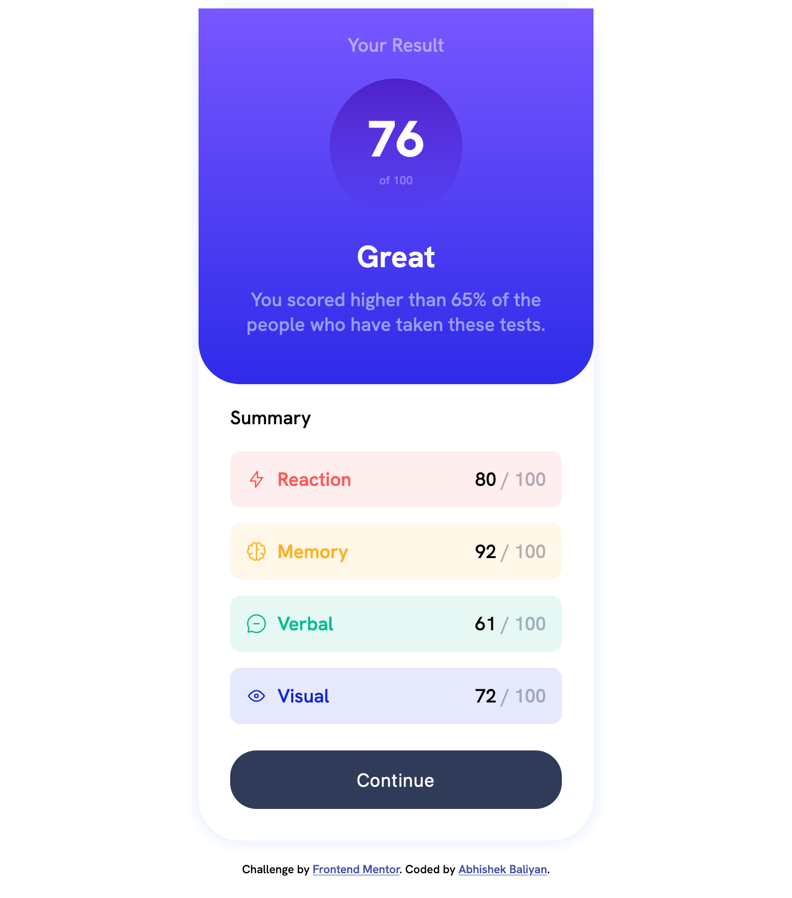

# Challenge: 1, Frontend Mentor - Results summary component solution

This is a solution to the [Results summary component challenge on Frontend Mentor](https://www.frontendmentor.io/challenges/results-summary-component-CE_K6s0maV). Frontend Mentor challenges help you improve your coding skills by building realistic projects. 

## Table of contents

- [Overview](#overview)
  - [The challenge](#the-challenge)
  - [Screenshot](#screenshot)
  - [Links](#links)
- [My process](#my-process)
  - [Built with](#built-with)
  - [What I learned](#what-i-learned)
  - [Continued development](#continued-development)
  - [Useful resources](#useful-resources)
- [Author](#author)
- [Acknowledgments](#acknowledgments)

## Overview

### The challenge

Users should be able to:

- View the optimal layout for the interface depending on their device's screen size
- See hover and focus states for all interactive elements on the page
- **Bonus**: Use the local JSON data to dynamically populate the content

### Screenshot




### Links

- Solution URL: [Solution](https://github.com/abhishek-baliyan-dev/Frontend-mentor-challenge-Results-summary-component)
- Live Site URL: [Live site URL](https://abhishek-baliyan-dev.github.io/Frontend-mentor-challenge-Results-summary-component/)

## My process

- First, I See the design then thought, how do I lay that out in html
- Then I wrote the HTML
- Second, how can i use CSS to achieve the layout
- Then I wrote the CSS for layout
- Third, how should each element be styled
- Then I wrote CSS for each element
- Finally I refactored the css

### Built with

- Semantic HTML5 markup
- CSS
- Flexbox
- Mobile-first workflow

### What I learned

- CSS Layout, Responsiveness, transparency, flexbox

This code below took some  time

```html
<div id="bg-circle">
  <h2>76</h2>
  <p>of 100</p>
</div>
```

```css
#bg-circle {
    margin: 20px auto;
    padding: 26px;
    border-radius: 50%;
    width: 126px;
    background: linear-gradient(hsla(256, 72%, 46%, 1), hsla(241, 72%, 46%, 0));
}
```

### Continued development

- CSS Grid
- In depth Flexbox

### Useful resources

- [Frontend Web Development for Beginners](https://www.youtube.com/playlist?list=PLYQSCk-qyTW37zDPzcAyzCsnypFQrhUcq) - This help me alot in the revision of HTML, CSS, JS.

## Author

- Website - [Abhishek Baliyan](https://www.abhishekbaliyan.com) - Coming soon
- Frontend Mentor - [@abhishek-baliyan-dev](https://www.frontendmentor.io/profile/abhishek-baliyan-dev)
- Twitter - [@Abhi___baliyan](https://twitter.com/Abhi___baliyan)

## Acknowledgments

I really appreciate the tutorial [youtube playlist](https://www.youtube.com/playlist?list=PLYQSCk-qyTW37zDPzcAyzCsnypFQrhUcq) of Frontend Web Development from [Zach Gollwitzer](https://www.youtube.com/@zachgoll).
